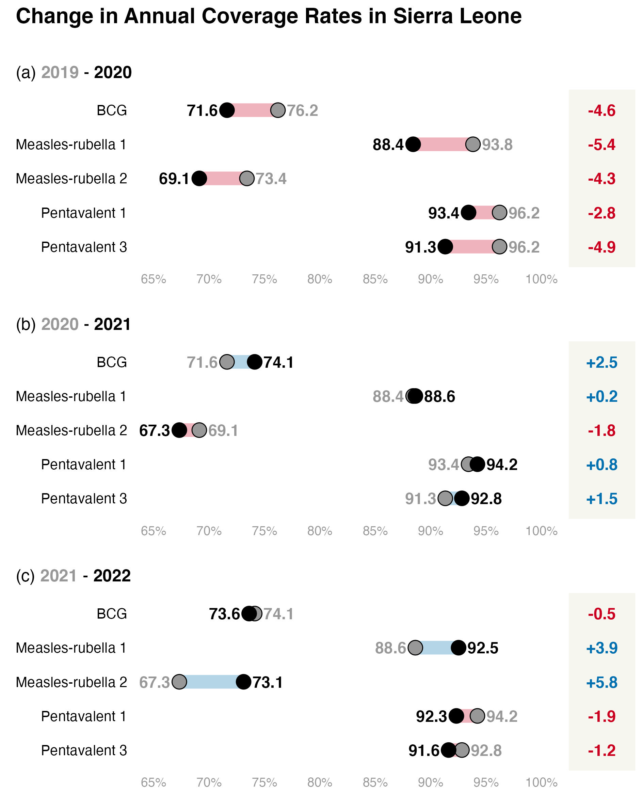
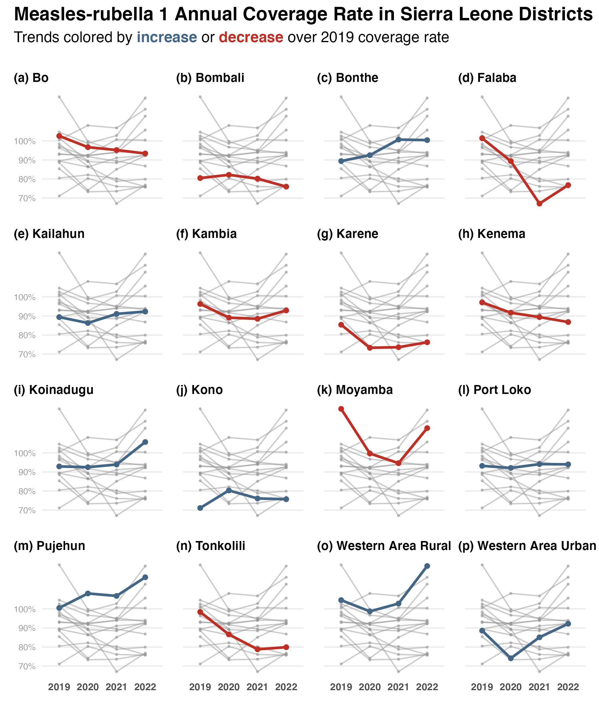

# Routine Immunization in Sierra Leona before and after COVID-19

## Overview

This repository contains R code to generate figures for a peer-reviewed publication on the impact of the COVID-19 pandemic on routine immunization in Sierra Leona[^readme-1].

[^readme-1]: Sesay, U., Serna-Chavez, H.M., Gebru, G.N. *et al.* Assessing the impact of COVID-19 on routine immunization in Sierra Leone. *BMC Public Health* **24**, 1795 (2024). <https://doi.org/10.1186/s12889-024-19221-2>

## Data Description

We used vaccination data from the District Health Information Systemn 2 (DHIS2) in Sierra Leona. We focused on the following antigens: BCG, Measles-Rubella 1 and 2, and Pentavalent 1 and 3. We compared annual coverage rates for these antigens across the years 2019, 2020, 2021, and 2022 at both national and district levels.

The raw data on routine immunization in Sierra Leona cannot be shared. The datasets generated during the study will be available as supplementary files.

## Repository Structure

README.md: This file provides an overview and instructions.

-   02_scripts/: Contains R scripts to produce the figures in the (forthcoming) paper.

    -   `01_national_deltas_dumbbell_plots.R`

    -   `02_district_timeseries_plot.R`

<!-- -->

-   03_functions/: Contains custom R functions used in the scripts.

    -   `functions.R`

-   04_output/: Contains examples of the generated figures in jpeg format.

## Scripts

### 01_national_deltas_dumbbell_plots.R

This script processes routine immunization data at the national level and produces a figure composed of three dumbbell plots, each representing a comparison between the following years: 2019-2020, 2020-2021, 2021-2022

Example Output:   

### 02_district_timeseries_plot.R

This script processes district-level immunization data and produces a matrix plot with a time series for each district, showing data from 2019 to 2021. The plotting code was inspired by Cedric Scherer's blog [post](https://www.cedricscherer.com/2023/07/05/efficiency-and-consistency-automate-subset-graphics-with-ggplot2-and-purrr/).

Example Output:    

